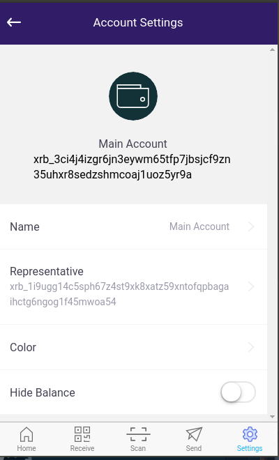
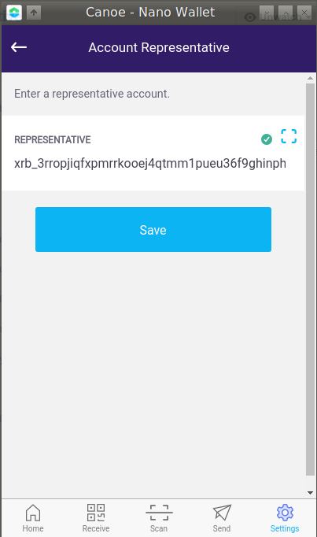
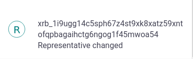

# Canoe

1. Go to settings > Wallet Accounts, click on the "Representative" entry

2. Scan the QR code of the  representative of your choice or insert the copied address:

3. Hit the "Save" button and you will hear the *send* confirmation sound. 
In the accounts transaction history you can see the "change block:

