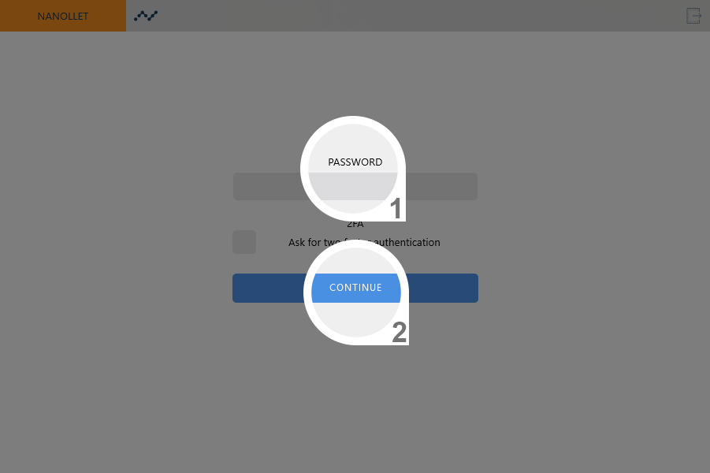
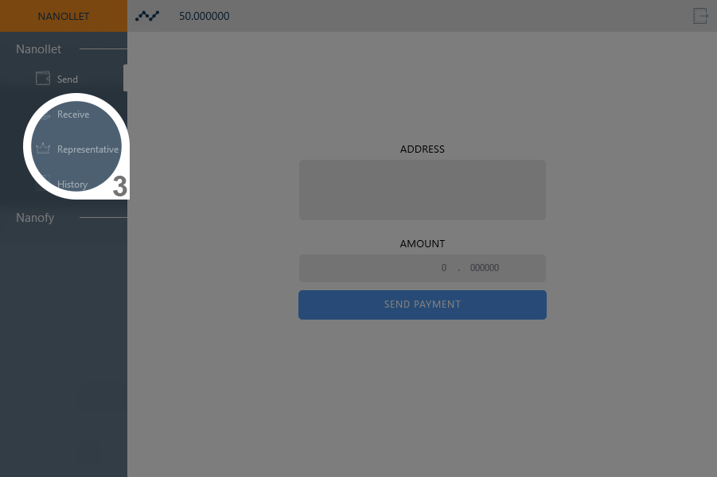
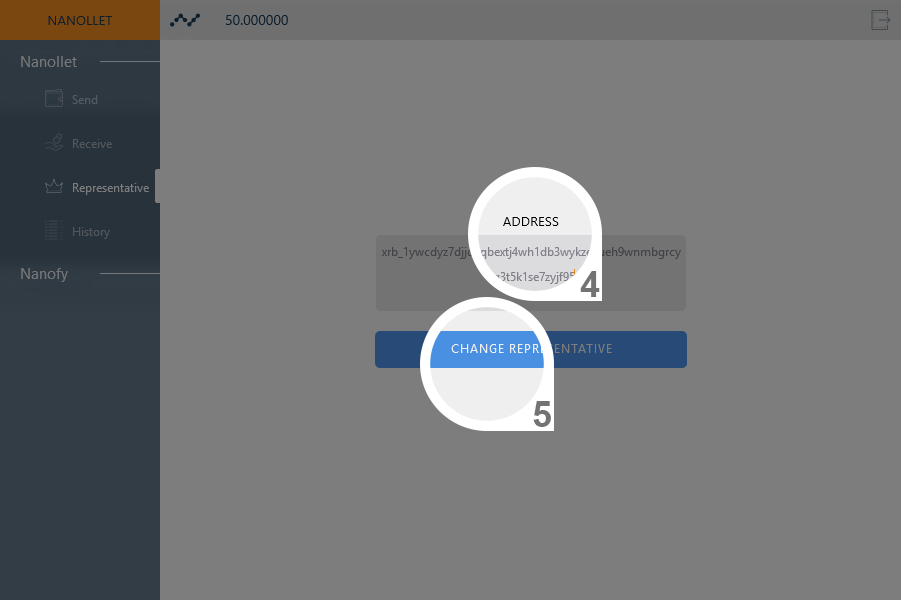
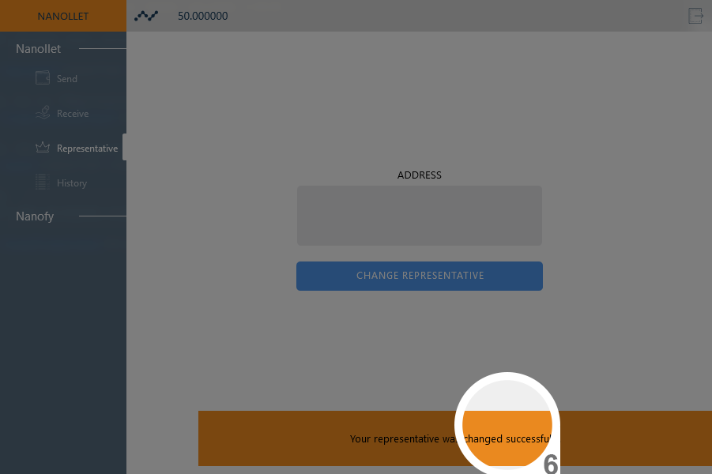

# Nanollet
> Require version at least version 2.0.0.

1. Enter the password (1) and continue (2), enable the 2FA if it's in use:

2. Click in "Representative" (3) in the left menu:

3. Set your representative (4) and continue (5):

4. Wait the confirmation (6), one notification will appear below.

